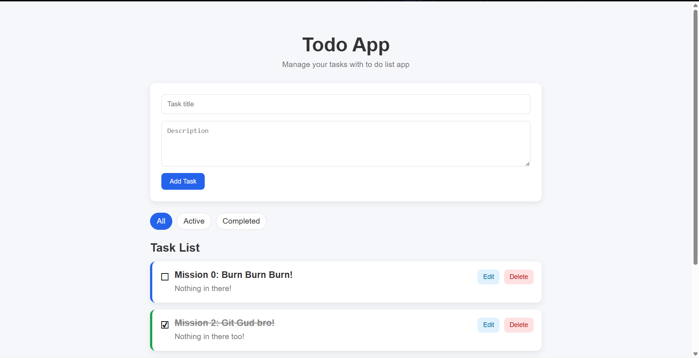
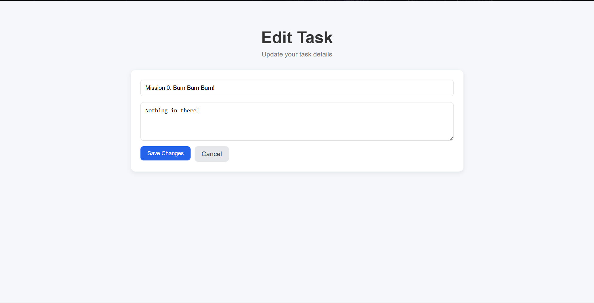
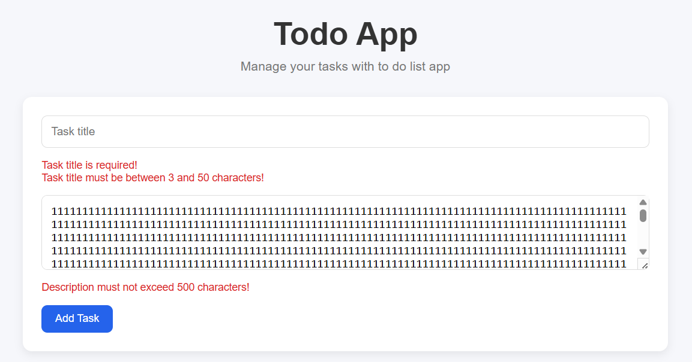

# Todo App

## Overview

A simple and responsive Todo List web application built with **Spring Boot** and **Thymeleaf**. The application allows users to manage daily tasks by creating, updating, deleting, completing, and filtering tasks. This project demonstrates the use of the Spring MVC architecture, data validation, and a professional Git workflow.

---

## Features

### Core Features

- View all tasks
- Add a new task
- Edit an existing task
- Delete a task
- Mark task as completed or incomplete
- Filter tasks by:
    - All
    - Active
    - Completed

### Validation

- Prevent empty task title
- Validate task title length
- Validate description length
- Display validation errors without losing user input

### User Interface

- Responsive design
- Modern card-based layout
- Clean and simple interface
- Hover effects
- Confirmation dialog before deleting a task

---

## Tech Stack

### Backend

- Java 17
- Spring Boot 3.5.16
- Spring MVC
- Spring Data JPA
- Hibernate

### Frontend

- Thymeleaf
- HTML5
- CSS3

### Database

- MySQL 8

### Build Tool

- Maven

### Version Control

- Git
- GitHub

---

## Project Structure

```text
todo-app
├── src
│   ├── main
│   │   ├── java
│   │   │   └── com.example.todoapp
│   │   │       ├── controller
│   │   │       ├── entity
│   │   │       ├── repository
│   │   │       ├── service
│   │   │       └── TodoappApplication.java
│   │   └── resources
│   │       ├── static
│   │       │   └── css
│   │       │       └── style.css
│   │       ├── templates
│   │       │   ├── index.html
│   │       │   └── edit.html
│   │       └── application.properties
│   └── test
├── .dockerignore
├── .env.example
├── .gitignore
├── compose.yaml
├── Dockerfile
├── mvnw
├── mvnw.cmd
└── pom.xml
```

---

## Application Architecture

```text
Browser
    │
    ▼
Spring MVC Controller
    │
    ▼
Service Layer
    │
    ▼
Repository (JPA)
    │
    ▼
MySQL Database
```

The project follows the MVC (Model-View-Controller) architecture to keep the code clean, modular, and maintainable.

---

## Screenshots

### Home Page

> **

### Edit Task

> **

### Validation

> **

---

## Installation

### Prerequisites

Before running the project, install:

- Java 17 or later
- Docker Desktop
- Git

Docker Desktop must be running before starting the database container.

### 1. Clone the repository

```bash
git clone https://github.com/ldhdung3103/todo-app.git
cd todo-app
```

### 2. Create the environment file

Copy `.env.example` to a new file named `.env`.

On Git Bash, macOS, or Linux:

```bash
cp .env.example .env
```

On Windows Command Prompt:

```cmd
copy .env.example .env
```

Example `.env` file:

```env
MYSQL_DATABASE=todo_db
MYSQL_USER=todo_user
MYSQL_PASSWORD=todo_password
MYSQL_ROOT_PASSWORD=root_password
```

The `.env` file contains local database credentials and is excluded from Git by `.gitignore`.

### 3. Start MySQL with Docker Compose

Run:

```bash
docker compose up -d
```

Docker Compose will:

- Download the MySQL 8 image when required
- Create the MySQL container
- Create the `todo_db` database
- Expose MySQL on host port `3307`
- Store database data in a persistent Docker volume

Check the container status:

```bash
docker compose ps
```

The database should be available at:

```text
Host: localhost
Port: 3307
Database: todo_db
```

### 4. Configure Spring Boot

Open:

```text
src/main/resources/application.properties
```

Example configuration:

```properties
spring.datasource.url=jdbc:mysql://localhost:3307/todo_db?useSSL=false&serverTimezone=UTC&allowPublicKeyRetrieval=true
spring.datasource.username=todo_user
spring.datasource.password=todo_password

spring.jpa.hibernate.ddl-auto=update
spring.jpa.show-sql=true
spring.jpa.properties.hibernate.format_sql=true
```

The username and password must match the values configured in `.env`.

### 5. Run the Spring Boot application

Using the Maven Wrapper on Git Bash, macOS, or Linux:

```bash
./mvnw spring-boot:run
```

Using Windows Command Prompt or PowerShell:

```powershell
.\mvnw.cmd spring-boot:run
```

The application can also be started by running `TodoappApplication.java` from IntelliJ IDEA.

### 6. Open the application

Open:

```text
http://localhost:8080
```

---

## Docker Commands

### Start the database container

```bash
docker compose up -d
```

### View container status

```bash
docker compose ps
```

### View MySQL logs

```bash
docker compose logs db
```

Follow logs continuously:

```bash
docker compose logs -f db
```

### Restart the container

```bash
docker compose restart
```

### Stop and remove the container

```bash
docker compose down
```

The database data remains stored in the Docker volume.

### Stop the container and delete database data

```bash
docker compose down -v
```

> Warning: The `-v` option permanently deletes the Docker volume and all database data stored in it.

---

## Running Without Docker

To run MySQL directly on the local machine:

1. Start the local MySQL server.
2. Create the database:

```sql
CREATE DATABASE todo_db;
```

3. Change the datasource port in `application.properties` from `3307` to `3306`.
4. Configure the correct local MySQL username and password.
5. Run the Spring Boot application.

---

## Git Workflow

This project was developed using a feature branch workflow.

```text
main
│
├── feature/task-crud
│
├── feature/task-edit-filter
│
├── feature/task-ui
│
└── feature/readme
```

Each feature follows the workflow below:

```text
Create Branch
      ↓
Implement Feature
      ↓
Commit
      ↓
Push
      ↓
Pull Request
      ↓
Code Review
      ↓
Merge
```

---

## Validation

This project uses Jakarta Bean Validation.

Implemented validations include:

- `@NotBlank`
- `@Size`
- `@Valid`
- `BindingResult`

Validation errors are displayed directly on the page without losing the current form data.

---

## Future Improvements

Although the required features have been completed, the following improvements can be added in the future:

- Search tasks by keyword
- Pagination
- Sorting
- Unit testing
- Spring Security authentication
- REST API
- Deploy to cloud platform

---

## Author

**Lê Dương Hoàng Dung**

GitHub:

https://github.com/ldhdung3103

---

## License

This project is licensed under the MIT License - see the LICENSE file for details.
